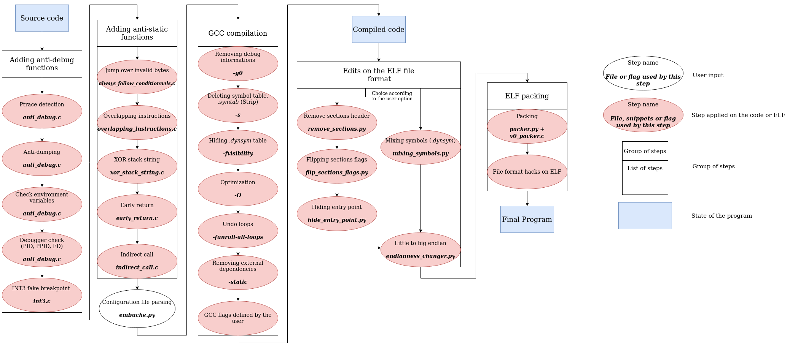

# Embuche - Anti-reverse compilation

**TODO**: Changer repo dans [Installation](./README.md#installation) quand repo independant

<p align="center">
  
</p>

Embuche is a tool that allows you to implement anti-reversing techniques during the different steps of the creation of an executable.

> Check out our poster [here](./docs/img/poster.png)!

## Summary

- [What is Embuche](./README.md#what-is-embuche)
- [Requirements and installation](./README.md#requirements-and-installation)
  - [Requirements](./README.md#requirements)
  - [Installation](./README.md#installation)
- [Usage](./README.md#usage)
  - [Project structure](./README.md#project-structure)
  - [Configuration](./README.md#configuration)
  - [Techniques dependencies](./README.md#techniques-dependencies)
  - [Run](./README.md#run)
- [Techniques](./README.md#techniques)
  - [Obstructing code analysis](./README.md#obstructing-code-analysis)
  - [Detecting debuggers](./README.md#detecting-debuggers)
  - [GCC options](./README.md#gcc-options)
  - [File format hacks](./README.md#file-format-hacks)
  - [Packer](./README.md#packer)
- [Docs](./docs/index.md)
- [Authors](./README.md#authors)

## What is Embuche

The main goal of Embuche is to implement a collection of anti-reversing techniques in order to make the task of a reverser harder and painful.

Embuche is designed for ELF files and C99.

Embuche will not make your program impossible to reverse, it will just increase the amount of time spent to reverse it.

Embuche is a collection of techniques and tools meant to make your program harder to reverse, you'll find:

- C snippets to obstruct code analysis
- Debugger detections
- A metamorphic packer
- Scripts to alter an ELF file
- Cmake generator

Embuche takes a C program and compiles it with GCC. It creates *CMake* files and *make* files that will be used for the compilation.

Inside these *CMake* files, there's the standard compilation process and some custom scripts that will modify the final ELF (depending on the options you've set).

Embuche is also a collection of C snippets (*snippets/*) to use in your program while creating it and a bunch of C functions to detect debugging.

Here's a schema on how Embuche works:



## Requirements and installation

Embuche was tested on Ubuntu 18.04, Arch 5.6.15 & Debian 10.

### Requirements

In order to use Embuche you need:

- gcc (7.5.0)
- cmake (3.16.8)
- make (4.1)
- Python (3.8)
- musl-tools (1.1.19-1)
- musl-dev (1.1.19-1)
- openssl (1.1.1)

You can install these packages with:

```
sudo add-apt-repository ppa:deadsnakes/ppa
sudo apt-get update
sudo apt install gcc musl-tools musl-dev cmake python3.8 python3.8-venv python3.8-dev libsasl2-dev python-dev libldap2-dev libssl-dev
```

## Installation

If the previous requirements are installed, you can clone this repo.

```bash
mkdir embuche && cd embuche
git clone git@github.com:Bookieman/Embuche.git .
```

You'll need the python project [Hellf](https://github.com/0xswitch/Hellf).

```bash
git clone git@github.com:0xswitch/Hellf.git
export PYTHONPATH=$PYTHONPATH:$(pwd)
```

The following python packages are also needed:

- pyOpenSSL==19.1.0
- Jinja2==2.11.2
- huepy==1.2.1
- pycryptodome==3.9.7
- PyYAML==5.3.1
- secrets==1.0.2

You can install them with:

```
python3.8 -m pip install -r requirements.txt
```

## Usage

### Project Structure

In order to use Embuche on a project, you have to follow this directory. structure:

```bash
myproject/
├── bin
├── build
└── src
    └── myprogram.c
```

Inside the `src` directory you'll have all your source code, the `build` directory will be used for the compilation and the `bin` directory will be the directory with your compiled program.

> I always forget the structure of a new project. Can you help me?

Well, if you don't have the time or energy to create this project structure you can simply use :

```
./tools/program_init_helper.py path/to/my/new/project
```

This script will create the structure of the project and create an empty c file (main.c) and some anti-debugging files you can use if you want.

### Configuration

Embuche uses a YAML configuration file. Here's an example of configuration (conf.yaml):

```yaml
source_code: "./example/crackme/src/crackme.c"
files:
  - "anti_debug.c"
options:
  compilation_options:
    strip:
      description: "Remove .symtab section (symbols on disk)"
      value: true
    symbols_hidden:
      description: "Hide .dynsym section (symbols at runtime)"
      value: true
    optimize:
      description: "Optimize code (O3)"
      value: true
    unroll_loops:
      description: "Unroll loop structure"
      value: true
    static:
      description: "Use static dependencies (musl)"
      value: true
    custom:
      description: "Add custom GCC flags"
      value:
        - "fstack-protector-all"
  file_format:
    endianness:
      description: "Switch endianness to big endian"
      value: true
    remove_section_header:
      description: "Remove section header"
      value: true
    flip_sections_flags:
      description: "Flip sections flags (RX to RW & RW to RX)"
      value: true
    hide_entry_point:
      description: "Hide entry point with fake oversized section"
      value: true
    mixing_symbols:
      description: "Mix the name of symbols in .dynsym"
      value: false
  packer:
    packer:
      description: "Cipher the final binary and insert it in a program that will unciphered it at start."
      value: true
    packer_embuche:
      description: "Modify the packed binary with: endianness, remove_section_header, flip_sections_flags and hide_entry_point"
      value: true
```

With this configuration we will compile *crackme.c* with the file it needs (*anti_debug.c*), then we will:

- Strip the binary
- Hide the symbol section
- Optimize the code
- Undo loop structure
- Use static libraries (musl) instead of libc.
- Add a GCC flag, `fstack-protector-all` (Stack Smashing Protection).
- Modify the endianness of the final ELF.
- Remove the section header table in the final ELF.
- Create fake *.data* and *.text* sections with wrong flags in the final ELF.
- Oversize the fake *.data* section to overflow the entrypoint in the final ELF.
- Pack the ELF file with the packer.
- Modify the endianness of the pack ELF.
- Remove the section header table in the packed ELF.
- Create fake *.data* and *.text* sections with wrong flags in the packed ELF.
- Oversize the fake *.data* section to overflow the entrypoint in the packed ELF.

[More on options](./docs/conf_file.md)

### Techniques dependencies

Some of the techniques are exclusive and can't be use with other techniques or some required an other techniques. Here's the dependencies between the techniques:

> Note: When *Dependency* the other option must be set to use it, when *Exclusion* the other options must not be set.

|                                 |symbols_hidden|static   |remove_section_header|flip_sections_flags|hide_entry_point|mixing_symbols|INT3 snippets|Ptrace (embuche_checker)|file_descriptor (embuche_checker)|packer   |
|---------------------------------|--------------|---------|---------------------|-------------------|----------------|--------------|-------------|------------------------|---------------------------------|---------|
|symbols_hidden                   |              |         |                     |                   |                |Exclusion     |             |                        |                                 |         |
|static                           |              |         |                     |                   |                |Exclusion     |             |                        |                                 |         |
|remove_section_header            |              |         |                     |Dependency         |Dependency      |Exclusion     |             |                        |                                 |         |
|flip_sections_flags              |              |         |                     |                   |                |Exclusion     |             |                        |                                 |         |
|hide_entry_point                 |              |         |                     |                   |                |Exclusion     |             |                        |                                 |         |
|mixing_symbols                   |Exclusion     |Exclusion|Exclusion            |Exclusion          |Exclusion       |              |             |                        |                                 |         |
|INT3 snippets                    |              |         |                     |                   |                |              |             |Exclusion               |                                 |         |
|Ptrace (embuche_checker)         |              |         |                     |                   |                |              |Exclusion    |                        |                                 |         |
|file_descriptor (embuche_checker)|              |         |                     |                   |                |              |             |                        |                                 |Exclusion|
|packer                           |              |         |                     |                   |                |              |             |                        |Exclusion                        |         |


### Run

Once you've setup your configuration file, you just have to have run Embuche like this:

```bash
./embuche.py conf.yaml
```

Embuche will create the CMake files and Make files and run the compilation.

Your binary will be available in the `bin` folder of your project.

## Techniques

You can learn more about this techniques in the [doc](./docs/index.md).

### Obstructing code analysis

Current snippets:

- **Jump over invalid bytes** (`always_follow_conditionnals.c`): Write some assembly that will be interpreted by the dissassembler but won't be executed by our program, this invalid bytes will be processed by the disassembler and mess with the disassembly it produces.  [MORE](./docs/obstructing-code-analysis.md#jump-over-invalid-bytes)
- **Early return** (`early_return.c`): Trick the disassembler and prevent it to disassemble a function by forcing it to exit a function earlier. [MORE](./docs/obstructing-code-analysis.md#early-return)
- **Indirect call** (`indirect_call.c`): Indirect call to function to limit cross-references in disassemblers.  [MORE](./docs/obstructing-code-analysis.md#pointer-function-calls)
- **INT3** (`int3.c`): Stop the debugger if there's one attached. [MORE](./docs/obstructing-code-analysis.md#int3)
- **Overlapping instructions** (`overlapping_instructions.c`): Write code that is executed twice but represents two different instructions.  [MORE](./docs/obstructing-code-analysis.md#overlapping-instructions)
- **Xor stacked string** (`xor_stack_string.c`): Create xor stacked strings to prevent `strings`.
You can use `tools/c_xor.py.` to generate the C code. [MORE](./docs/obstructing-code-analysis.md#prevent-strings)

### Detecting Debuggers

Here's the techniques used to detect debugging:

- **dumpable**: Disable process memory dump. [MORE](./docs/detect-debug.md#disable-core-dump)
- **ptrace**: Check if *ptrace* is already attached or not. **CAUTION: DON'T USE THIS OPTIONS IF YOU'VE IMPLEMENTED INT3 TECHNIQUE**. [MORE](./docs/detect-debug.md#attach-to-ptrace)
- **file_descriptor**: Count the number of file descriptor to check if GDB is used. **CAUTION: THIS OPTIONS CANNOT BE SET WITH THE PACKER**. [MORE](./docs/detect-debug.md#file-descriptor)
- **pid**: Check the process name to see if it's GDB. [MORE](./docs/detect-debug.md#detect-GDB-by-its-pid)
- **ppid**: Check the name of the parent process to see if it's GDB. [MORE](./docs/detect-debug.md#check-the-parent-name)
- **ld_preload**: Check the environment variables to detect LD_PRELOAD. [MORE](./docs/detect-debug.md#detect-ld_preload)

### GCC Options

Here's the list of GCC flags in Embuche by default:

- **Wall**: Show all warnings.
- **Wextra**: Show extra warnings (unused etc).
- **Wshadow**: Show local variable or type declaration that shadows other variables.
- **g0**: Disable debug informations. [MORE](./docs/compiler-options.md#debugging-information)
- **std=gnu11**: C language dialect.

Available options for compilation:

- **strip** (-s): Remove `.symtab` section. [MORE](./docs/compiler-options.md#delete-the-symbol-table-strip)
- **symbols_hidden** (-fvisibility=hidden): Hide `.dynsym` section. [MORE](./docs/compiler-options.md#hide-symbol)
- **optimize** (-O3): Optimize code (level 3). [MORE](./docs/compiler-options.md#optimization)
- **unroll_loops** (-funroll-all-loops): Undo loop structures. [MORE](./docs/compiler-options.md#unroll-loops)
- **static** (-s): Use static dependencies instead of external ones (musl). [MORE](./docs/compiler-options.md#static-compilation)

### File Format Hacks

Here's the techniques available:

- **endianness** (`endianness_changer.py`): Change the endianness in the ELF header from little to big endian. [MORE](./docs/file-format-hacks.md#change-the-endianness)
- **remove_section_header** (`remove_sections.py`): Remove the section header table. [MORE](./docs/file-format-hacks.md#remove-section-header-table)
- **flip_sections_flags** (`flip_sections_flags.py`): Create a fake *.text* section with *RX* instead of *RW* and fake *.data* section with *RW* instead of *RX*. [MORE](./docs/file-format-hacks.md#create-fake-sections)
- **hide_entry_point** (`hide_entry_point.py`): Create a fake *.data* section that override the entry point. [MORE](./docs/file-format-hacks.md#hide-the-entry-point)
- **mixing_symbols** (`mixing_symbols_table.py`): Create a fake *.dynsym* section and mix symbols names. [MORE](./docs/file-format-hacks.md#mix-symbol-table)


### Packer

A metamorphic packer is available in Embuche. This packer will load your binary and cipher it (AES 256 bits CBC).

If you decide to use the packer, your program will be ciphered and stored in a section of our packer. When you will execute your program the packer will copy itself in memory, unciphered your program and write it on the disk for execution.

Beside cipher your binary, the packer will also ensure its integrity. The encryption keys used for the encryption are based on the SHA sum of the `.text` section, so if the packer or your program is being debugged the SHA sum will be different of the one used for decryption.

The ELF of the packer can be modified with the `packer_embuche` options.
If this options is set the following techniques will be applied on the packer that contains your program:

- **endianness**: Change the endianness in the ELF header from little to big endian.
- **remove_section_header**: Remove the section header table.
- **flip_sections_flags**: Create a fake *.text* section with *RX* instead of *RW* and fake *.data* section with *RW* instead of *RX*.
- **hide_entry_point**: Create a fake *.data* section that override the entry point.

[MORE](./docs/packer.md)

## Authors

- [Bookie](https://twitter.com/bookiem4n)
- [LX6](https://github.com/LX-6)
- [Magnussen](https://www.magnussen.funcmylife.fr)
- [Switch](https://0xswitch.fr)
