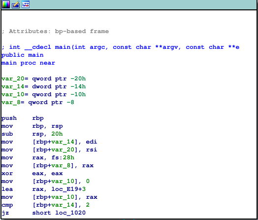
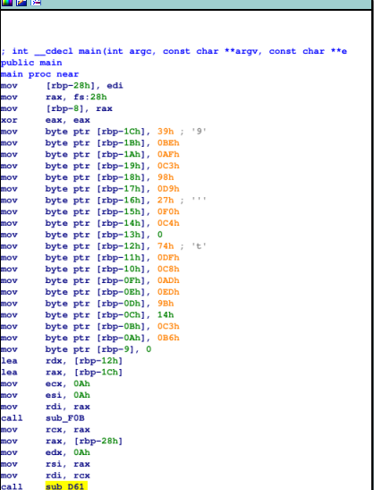
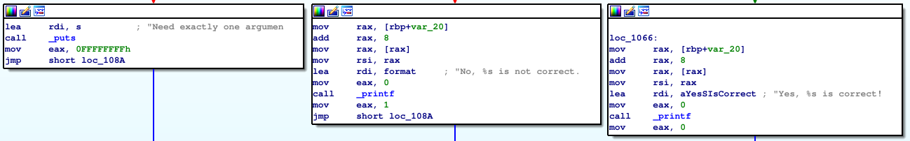
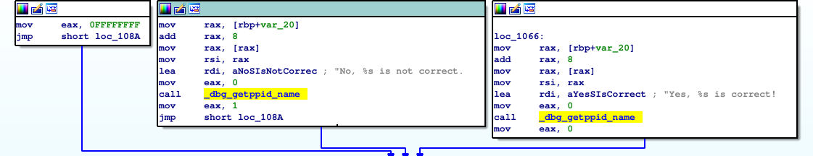

# File format hacks

## Summary

- [TL;DR](file-format-hacks.md#tl-dr)
- [Change the endianness](file-format-hacks.md#change-the-endianness)
- [Remove section header table](file-format-hacks.md#remove-section-header-table)
- [Create fake sections](file-format-hacks.md#create-fake-sections)
- [Hide the entry point](file-format-hacks.md#hide-the-entry-point)
- [Mix symbol table](file-format-hacks.md#mix-symbol-table)
- [Impact on disassemblers](file-format-hacks.md#impact-on-disassemblers)

## TL;DR

- The endianness in an ELF header can be changed to mess with disassemblers as they're meant to read multiple architectures (The CPU loader doesn’t need to check the endianness because it can only execute little or big-endian).
- Some disassemblers rather use the sections than the segments, but as the sections aren't needed at runtime, we can remove them, create fake ones or hide the entry point by oversizing the first section.
- The **.dynsym** is always needed, but we can create a fake one an point it in our ELF header to mix our function's names in *IDA*.
- *Radare2* rather use the *segments* than the *sections* but rely a lot on the ELF header as *IDA* privileges the *sections* but doesn't rely on the ELF header.

## Change the endianness

The endianness is the order in which a sequence of bytes is stored in memory. There's different kind of endianness, but the most known are little-endian and big-endian. The difference is the way they order a sequence of byte:

- Big-endian: The least-significant byte is stored at the largest address and the least significant is stored at the smallest one. ("From left to right")
- Little-endian: The least-significant byte is stored at the smallest address and the most-significant at the largest one. ("From right to left")


So if we have this sequence of bytes: 0A CA B6 66, it will be stored as:

- Big-endian: 0x0ACAB666
- Little-endian: 0x66B6CA0A

The endianness in use is determined by the way the CPU reads a sequence of bytes.

As a system is either little-endian or big-endian (unless its ARM, which can be bi-endian), a loader doesn’t need to check the endianness because it can only execute one or the other.

This endianness is defined in the sixth byte of the ELF header (*EI_DATA*).

```
EI_DATA encoding:
  ELFDATANONE: Unknown data format. (0x00)
  ELFDATA2LSB: Two's complement, little-endian. (0x01)
  ELFDATA2MSB: Two's complement, big-endian. (0x02)
```

So the loader doesn't check the sixth byte because it can only execute little or big-endian.

However, tools like **readelf**, **Radare2**, and **IDA** expects to read files from many
architectures.

So if you modify this byte, your program will still run as expected, but tools that need the *EI_DATA* will behave differently.

For example, **GDB** will not recognize the format of the file and will not be able to load it.

As saw before the endianness is defined in the sixth byte of an ELF, if the byte is 0x01 the endianness is little-endian, if the sixth byte is 0x02, the endianness is big-endian. We can modify the endianness as follows:

```bash
magnussen@funcMyLife:~/embuche/bin$ readelf -h crackme
ELF Header:
  Magic:   7f 45 4c 46 02 01 01 00 00 00 00 00 00 00 00 00
  Class:                             ELF64
  Data:                              2's complement, little endian
  Version:                           1 (current)
  OS/ABI:                            UNIX - System V
  ABI Version:                       0
  Type:                              EXEC (Executable file)
  Machine:                           Advanced Micro Devices X86-64
  Version:                           0x1
  Entry point address:               0x4011d0
  Start of program headers:          64 (bytes into file)
  Start of section headers:          60448 (bytes into file)
  Flags:                             0x0
  Size of this header:               64 (bytes)
  Size of program headers:           56 (bytes)
  Number of program headers:         9
  Size of section headers:           64 (bytes)
  Number of section headers:         36
  Section header string table index: 35
magnussen@funcMyLife:~/embuche/bin$ printf '\x02' | dd conv=notrunc of=./crackme bs=1 seek=5
magnussen@funcMyLife:~/embuche/bin$ readelf -h crackme
ELF Header:
  Magic:   7f 45 4c 46 02 02 01 00 00 00 00 00 00 00 00 00
  Class:                             ELF64
  Data:                              2's complement, big endian
  Version:                           1 (current)
  OS/ABI:                            UNIX - System V
  ABI Version:                       0
  Type:                              <unknown>: 200
  Machine:                           <unknown>: 0x3e00
  Version:                           0x1000000
  Entry point address:               0xd011400000000000
  Start of program headers:          4611686018427387904 (bytes into file)
  Start of section headers:          2372271103717408768 (bytes into file)
  Flags:                             0x0
  Size of this header:               16384 (bytes)
  Size of program headers:           14336 (bytes)
  Number of program headers:         2304
  Size of section headers:           16384 (bytes)
  Number of section headers:         9216
  Section header string table index: 8960
readelf: Warning: The e_shentsize field in the ELF header is larger than the size of an ELF section header
readelf: Error: Reading 150994944 bytes extends past end of file for section headers
readelf: Error: Too many program headers - 0x900 - the file is not that big
```

By rewriting the sixth byte from 0x01 to 0x02 we've changed the endianness in the ELF header and `readelf` reads the ELF file as big-endian but as our CPU is only using little-endian it execute it in little-endian.

The program is still executable, but every tool that uses the ELF header will read our program in big-endian.

Just changing that one byte makes the job of a reverser a lot more difficult if he doesn't know that the endianness is wrong.

> We've created a small python script to modify the endianness, you can find it [here](../class_embuche/cmake_bakery/hellf_scripts/endianness_changer.py)

## Remove section header table

The sections of a program describe the program on disk, whereas the segments describes the program at runtime.

The section header table breaks down the binary in very specific chunks and can be useful to a reverser to gain knowledge on how the program works. As the sections aren't used at runtime, the section header table isn't needed for execution, we can remove it and our program will still be executable.

Some debuggers and dissassemblers initialize their analysis with the sections, if we remove the section header table, they won't be able to properly initialize the program.

There are four variables from the ELF header that are used to find, parse, and display
the section header table:

- Start of section headers (**E_SHOFF**): The offset where the section headers start.
- Size of section headers (**E_SHENTSIZE**): The size of a section header.
- Number of section headers (**E_SHNUM**): The number of section headers.
- Section header string table index (**E_SHSTRNDX**): The location of the section header string table (name of the sections).

If you set the value of these variables at 0 then locating or parsing the table would be impossible.

You can use a hex editor like *flex* or *hex edit* to modify these values.

```bash
magnussen@funcMyLife:~/embuche/bin$ readelf -h crackme
ELF Header:
  Magic:   7f 45 4c 46 02 01 01 00 00 00 00 00 00 00 00 00
  Class:                             ELF64
  Data:                              2's complement, little endian
  Version:                           1 (current)
  OS/ABI:                            UNIX - System V
  ABI Version:                       0
  Type:                              DYN (Shared object file)
  Machine:                           Advanced Micro Devices X86-64
  Version:                           0x1
  Entry point address:               0xd50
  Start of program headers:          64 (bytes into file)
  Start of section headers:          11760 (bytes into file)
  Flags:                             0x0
  Size of this header:               64 (bytes)
  Size of program headers:           56 (bytes)
  Number of program headers:         9
  Size of section headers:           64 (bytes)
  Number of section headers:         29
  Section header string table index: 28
magnussen@funcMyLife:~/embuche/bin$ readelf -S crackme
There are 29 section headers, starting at offset 0x2df0:

Section Headers:
  [Nr] Name              Type             Address           Offset
       Size              EntSize          Flags  Link  Info  Align
  [ 0]                   NULL             0000000000000000  00000000
       0000000000000000  0000000000000000           0     0     0
  [ 1] .interp           PROGBITS         0000000000000238  00000238
       000000000000001c  0000000000000000   A       0     0     1
  [ 2] .note.ABI-tag     NOTE             0000000000000254  00000254
       0000000000000020  0000000000000000   A       0     0     4
  [ 3] .note.gnu.build-i NOTE             0000000000000274  00000274
       0000000000000024  0000000000000000   A       0     0     4
  [ 4] .gnu.hash         GNU_HASH         0000000000000298  00000298
       00000000000000c0  0000000000000000   A       5     0     8
  [ 5] .dynsym           DYNSYM           0000000000000358  00000358
       0000000000000420  0000000000000018   A       6     1     8
  [ 6] .dynstr           STRTAB           0000000000000778  00000778
       00000000000001e4  0000000000000000   A       0     0     1
  [ 7] .gnu.version      VERSYM           000000000000095c  0000095c
       0000000000000058  0000000000000002   A       5     0     2
  [ 8] .gnu.version_r    VERNEED          00000000000009b8  000009b8
       0000000000000030  0000000000000000   A       6     1     8
  [ 9] .rela.dyn         RELA             00000000000009e8  000009e8
       00000000000000d8  0000000000000018   A       5     0     8
  [10] .rela.plt         RELA             0000000000000ac0  00000ac0
       0000000000000168  0000000000000018  AI       5    22     8
  [11] .init             PROGBITS         0000000000000c28  00000c28
       0000000000000017  0000000000000000  AX       0     0     4
  [12] .plt              PROGBITS         0000000000000c40  00000c40
       0000000000000100  0000000000000010  AX       0     0     16
  [13] .plt.got          PROGBITS         0000000000000d40  00000d40
       0000000000000008  0000000000000008  AX       0     0     8
  [14] .text             PROGBITS         0000000000000d50  00000d50
       00000000000008b2  0000000000000000  AX       0     0     16
  [15] .fini             PROGBITS         0000000000001604  00001604
       0000000000000009  0000000000000000  AX       0     0     4
  [16] .rodata           PROGBITS         0000000000001610  00001610
       000000000000009a  0000000000000000   A       0     0     4
  [17] .eh_frame_hdr     PROGBITS         00000000000016ac  000016ac
       000000000000008c  0000000000000000   A       0     0     4
  [18] .eh_frame         PROGBITS         0000000000001738  00001738
       0000000000000278  0000000000000000   A       0     0     8
  [19] .init_array       INIT_ARRAY       0000000000201d40  00001d40
       0000000000000010  0000000000000008  WA       0     0     8
  [20] .fini_array       FINI_ARRAY       0000000000201d50  00001d50
       0000000000000008  0000000000000008  WA       0     0     8
  [21] .dynamic          DYNAMIC          0000000000201d58  00001d58
       00000000000001f0  0000000000000010  WA       6     0     8
  [22] .got              PROGBITS         0000000000201f48  00001f48
       00000000000000b8  0000000000000008  WA       0     0     8
  [23] .data             PROGBITS         0000000000202000  00002000
       0000000000000010  0000000000000000  WA       0     0     8
  [24] .bss              NOBITS           0000000000202010  00002010
       0000000000000008  0000000000000000  WA       0     0     1
  [25] .comment          PROGBITS         0000000000000000  00002010
       0000000000000029  0000000000000001  MS       0     0     1
  [26] .symtab           SYMTAB           0000000000000000  00002040
       00000000000008d0  0000000000000018          27    51     8
  [27] .strtab           STRTAB           0000000000000000  00002910
       00000000000003e0  0000000000000000           0     0     1
  [28] .shstrtab         STRTAB           0000000000000000  00002cf0
       00000000000000fe  0000000000000000           0     0     1
Key to Flags:
  W (write), A (alloc), X (execute), M (merge), S (strings), I (info),
  L (link order), O (extra OS processing required), G (group), T (TLS),
  C (compressed), x (unknown), o (OS specific), E (exclude),
  l (large), p (processor specific)
magnussen@funcMyLife:~/embuche/bin$ python3.8 ../class_embuche/cmake_bakery/hellf_scripts/remove_sections.py crackme
magnussen@funcMyLife:~/embuche/bin$ readelf -h crackme
ELF Header:
  Magic:   7f 45 4c 46 02 01 01 00 00 00 00 00 00 00 00 00
  Class:                             ELF64
  Data:                              2's complement, little endian
  Version:                           1 (current)
  OS/ABI:                            UNIX - System V
  ABI Version:                       0
  Type:                              DYN (Shared object file)
  Machine:                           Advanced Micro Devices X86-64
  Version:                           0x1
  Entry point address:               0xd50
  Start of program headers:          64 (bytes into file)
  Start of section headers:          0 (bytes into file)
  Flags:                             0x0
  Size of this header:               64 (bytes)
  Size of program headers:           56 (bytes)
  Number of program headers:         9
  Size of section headers:           0 (bytes)
  Number of section headers:         0
  Section header string table index: 0
magnussen@funcMyLife:~/embuche/bin$ readelf -S crackme
There are no sections in this file.
```

> We've created a small python script to set these variables at 0, you can find it [here](../class_embuche/cmake_bakery/hellf_scripts/remove_sections.py)

## Create fake sections

Previously we removed the section header table, but we can also create a fake one.

The program doesn't need the section header table to be executed so it won't care about the fake one, but a disassembler might use the section header table to disassemble the program.

An important part of the section header and program header is the **flags** field, it describes if the section or segment is executable, writable, and/or readable. The flag of a section is the same flag as the segment.

Some disassembler will use the section header table and their flags rather than the program header.

We can create a fake sections with wrong flags to mess with the disassembler.

Here's a sample of sections that you can put in your fake section header table:

- **SHT_NULL**: This is commonly placed at the beginning of a section table and it would look weird if left out.
- **SHT_PROGBITS**: You can set the address space to cover the first LOAD segment. However, instead of being *re* (read/execute) like the first LOAD it will be *rw* (read/write) like the second LOAD. The name of the section will be *.data* so it’ll look like a normal data section.
- Another **SHT_PROGBITS**: In this section, you’ll set the address space to cover the second LOAD segment. This time marks the segment as *re* instead of *rw*. The name for this section should be *.text* since it’ll look like a code segment.

For example, *IDA* will find less functions and its analysis will be less complete because its decompiles only sections with executable flags. This forces the reverser to manually disassemble these types of sections.

```bash
magnussen@funcMyLife:~/embuche/bin$ readelf -h crackme
ELF Header:
  Magic:   7f 45 4c 46 02 01 01 00 00 00 00 00 00 00 00 00
  Class:                             ELF64
  Data:                              2's complement, little endian
  Version:                           1 (current)
  OS/ABI:                            UNIX - System V
  ABI Version:                       0
  Type:                              DYN (Shared object file)
  Machine:                           Advanced Micro Devices X86-64
  Version:                           0x1
  Entry point address:               0xd50
  Start of program headers:          64 (bytes into file)
  Start of section headers:          11760 (bytes into file)
  Flags:                             0x0
  Size of this header:               64 (bytes)
  Size of program headers:           56 (bytes)
  Number of program headers:         9
  Size of section headers:           64 (bytes)
  Number of section headers:         29
  Section header string table index: 28
magnussen@funcMyLife:~/embuche/bin$ readelf -S crackme
There are 29 section headers, starting at offset 0x2df0:

Section Headers:
  [Nr] Name              Type             Address           Offset
       Size              EntSize          Flags  Link  Info  Align
  [ 0]                   NULL             0000000000000000  00000000
       0000000000000000  0000000000000000           0     0     0
  [ 1] .interp           PROGBITS         0000000000000238  00000238
       000000000000001c  0000000000000000   A       0     0     1
  [ 2] .note.ABI-tag     NOTE             0000000000000254  00000254
       0000000000000020  0000000000000000   A       0     0     4
  [ 3] .note.gnu.build-i NOTE             0000000000000274  00000274
       0000000000000024  0000000000000000   A       0     0     4
  [ 4] .gnu.hash         GNU_HASH         0000000000000298  00000298
       00000000000000c0  0000000000000000   A       5     0     8
  [ 5] .dynsym           DYNSYM           0000000000000358  00000358
       0000000000000420  0000000000000018   A       6     1     8
  [ 6] .dynstr           STRTAB           0000000000000778  00000778
       00000000000001e4  0000000000000000   A       0     0     1
  [ 7] .gnu.version      VERSYM           000000000000095c  0000095c
       0000000000000058  0000000000000002   A       5     0     2
  [ 8] .gnu.version_r    VERNEED          00000000000009b8  000009b8
       0000000000000030  0000000000000000   A       6     1     8
  [ 9] .rela.dyn         RELA             00000000000009e8  000009e8
       00000000000000d8  0000000000000018   A       5     0     8
  [10] .rela.plt         RELA             0000000000000ac0  00000ac0
       0000000000000168  0000000000000018  AI       5    22     8
  [11] .init             PROGBITS         0000000000000c28  00000c28
       0000000000000017  0000000000000000  AX       0     0     4
  [12] .plt              PROGBITS         0000000000000c40  00000c40
       0000000000000100  0000000000000010  AX       0     0     16
  [13] .plt.got          PROGBITS         0000000000000d40  00000d40
       0000000000000008  0000000000000008  AX       0     0     8
  [14] .text             PROGBITS         0000000000000d50  00000d50
       00000000000008b2  0000000000000000  AX       0     0     16
  [15] .fini             PROGBITS         0000000000001604  00001604
       0000000000000009  0000000000000000  AX       0     0     4
  [16] .rodata           PROGBITS         0000000000001610  00001610
       000000000000009a  0000000000000000   A       0     0     4
  [17] .eh_frame_hdr     PROGBITS         00000000000016ac  000016ac
       000000000000008c  0000000000000000   A       0     0     4
  [18] .eh_frame         PROGBITS         0000000000001738  00001738
       0000000000000278  0000000000000000   A       0     0     8
  [19] .init_array       INIT_ARRAY       0000000000201d40  00001d40
       0000000000000010  0000000000000008  WA       0     0     8
  [20] .fini_array       FINI_ARRAY       0000000000201d50  00001d50
       0000000000000008  0000000000000008  WA       0     0     8
  [21] .dynamic          DYNAMIC          0000000000201d58  00001d58
       00000000000001f0  0000000000000010  WA       6     0     8
  [22] .got              PROGBITS         0000000000201f48  00001f48
       00000000000000b8  0000000000000008  WA       0     0     8
  [23] .data             PROGBITS         0000000000202000  00002000
       0000000000000010  0000000000000000  WA       0     0     8
  [24] .bss              NOBITS           0000000000202010  00002010
       0000000000000008  0000000000000000  WA       0     0     1
  [25] .comment          PROGBITS         0000000000000000  00002010
       0000000000000029  0000000000000001  MS       0     0     1
  [26] .symtab           SYMTAB           0000000000000000  00002040
       00000000000008d0  0000000000000018          27    51     8
  [27] .strtab           STRTAB           0000000000000000  00002910
       00000000000003e0  0000000000000000           0     0     1
  [28] .shstrtab         STRTAB           0000000000000000  00002cf0
       00000000000000fe  0000000000000000           0     0     1
Key to Flags:
  W (write), A (alloc), X (execute), M (merge), S (strings), I (info),
  L (link order), O (extra OS processing required), G (group), T (TLS),
  C (compressed), x (unknown), o (OS specific), E (exclude),
  l (large), p (processor specific)
magnussen@funcMyLife:~/embuche/bin$ readelf -l crackme
  Elf file type is DYN (Shared object file)
  Entry point 0xd50
  There are 9 program headers, starting at offset 64

  Program Headers:
    Type           Offset             VirtAddr           PhysAddr
                   FileSiz            MemSiz              Flags  Align
    PHDR           0x0000000000000040 0x0000000000000040 0x0000000000000040
                   0x00000000000001f8 0x00000000000001f8  R      0x8
    INTERP         0x0000000000000238 0x0000000000000238 0x0000000000000238
                   0x000000000000001c 0x000000000000001c  R      0x1
        [Requesting program interpreter: /lib64/ld-linux-x86-64.so.2]
    LOAD           0x0000000000000000 0x0000000000000000 0x0000000000000000
                   0x00000000000019b0 0x00000000000019b0  R E    0x200000
    LOAD           0x0000000000001d40 0x0000000000201d40 0x0000000000201d40
                   0x00000000000002d0 0x00000000000002d8  RW     0x200000
    DYNAMIC        0x0000000000001d58 0x0000000000201d58 0x0000000000201d58
                   0x00000000000001f0 0x00000000000001f0  RW     0x8
    NOTE           0x0000000000000254 0x0000000000000254 0x0000000000000254
                   0x0000000000000044 0x0000000000000044  R      0x4
    GNU_EH_FRAME   0x00000000000016ac 0x00000000000016ac 0x00000000000016ac
                   0x000000000000008c 0x000000000000008c  R      0x4
    GNU_STACK      0x0000000000000000 0x0000000000000000 0x0000000000000000
                   0x0000000000000000 0x0000000000000000  RW     0x10
    GNU_RELRO      0x0000000000001d40 0x0000000000201d40 0x0000000000201d40
                   0x00000000000002c0 0x00000000000002c0  R      0x1
magnussen@funcMyLife:~/embuche/bin$ python3.8 ../class_embuche/cmake_bakery/hellf_scripts/remove_sections.py crackme
magnussen@funcMyLife:~/embuche/bin$ python3.8 ../class_embuche/cmake_bakery/hellf_scripts/flip_sections_flags.py crackme
magnussen@funcMyLife:~/embuche/bin$ readelf -h crackme
ELF Header:
  Magic:   7f 45 4c 46 02 01 01 00 00 00 00 00 00 00 00 00
  Class:                             ELF64
  Data:                              2's complement, little endian
  Version:                           1 (current)
  OS/ABI:                            UNIX - System V
  ABI Version:                       0
  Type:                              DYN (Shared object file)
  Machine:                           Advanced Micro Devices X86-64
  Version:                           0x1
  Entry point address:               0xd50
  Start of program headers:          64 (bytes into file)
  Start of section headers:          13617 (bytes into file)
  Flags:                             0x0
  Size of this header:               64 (bytes)
  Size of program headers:           56 (bytes)
  Number of program headers:         9
  Size of section headers:           64 (bytes)
  Number of section headers:         4
  Section header string table index: 3
magnussen@funcMyLife:~/embuche/bin$ readelf -S crackme
There are 4 section headers, starting at offset 0x3531:

Section Headers:
  [Nr] Name              Type             Address           Offset
       Size              EntSize          Flags  Link  Info  Align
  [ 0]                   NULL             0000000000000000  00000000
       0000000000000000  0000000000000000           0     0     0
  [ 1] .data             PROGBITS         0000000000000000  00000000
       00000000000019b0  0000000000000000  WA       0     0     4
  [ 2] .text             PROGBITS         0000000000201d40  00001d40
       00000000000002d0  0000000000000000  AX       0     0     4
  [ 3] .shstrtab         STRTAB           0000000000000000  00003631
       0000000000000017  0000000000000000           0     0     4
Key to Flags:
  W (write), A (alloc), X (execute), M (merge), S (strings), I (info),
  L (link order), O (extra OS processing required), G (group), T (TLS),
  C (compressed), x (unknown), o (OS specific), E (exclude),
  l (large), p (processor specific)
magnussen@funcMyLife:~/embuche/bin$ readelf -l crackme

Elf file type is DYN (Shared object file)
Entry point 0xd50
There are 9 program headers, starting at offset 64

Program Headers:
  Type           Offset             VirtAddr           PhysAddr
                 FileSiz            MemSiz              Flags  Align
  PHDR           0x0000000000000040 0x0000000000000040 0x0000000000000040
                 0x00000000000001f8 0x00000000000001f8  R      0x8
  INTERP         0x0000000000000238 0x0000000000000238 0x0000000000000238
                 0x000000000000001c 0x000000000000001c  R      0x1
      [Requesting program interpreter: /lib64/ld-linux-x86-64.so.2]
  LOAD           0x0000000000000000 0x0000000000000000 0x0000000000000000
                 0x00000000000019b0 0x00000000000019b0  R E    0x200000
  LOAD           0x0000000000001d40 0x0000000000201d40 0x0000000000201d40
                 0x00000000000002d0 0x00000000000002d8  RW     0x200000
  DYNAMIC        0x0000000000001d58 0x0000000000201d58 0x0000000000201d58
                 0x00000000000001f0 0x00000000000001f0  RW     0x8
  NOTE           0x0000000000000254 0x0000000000000254 0x0000000000000254
                 0x0000000000000044 0x0000000000000044  R      0x4
  GNU_EH_FRAME   0x00000000000016ac 0x00000000000016ac 0x00000000000016ac
                 0x000000000000008c 0x000000000000008c  R      0x4
  GNU_STACK      0x0000000000000000 0x0000000000000000 0x0000000000000000
                 0x0000000000000000 0x0000000000000000  RW     0x10
  GNU_RELRO      0x0000000000001d40 0x0000000000201d40 0x0000000000201d40
                 0x00000000000002c0 0x00000000000002c0  R      0x1
```

We successfully manage to create fake sections with wrong flags, but the segments still have the correct flag and our program is still executable.

> We've created a small python script to create these fake sections, you can find it [here](../class_embuche/cmake_bakery/hellf_scripts/flip_sections_flags.py), you have to remove the section header table before using it with this [script](../class_embuche/cmake_bakery/hellf_scripts/remove_sections.py).

## Hide the entry point

The entry point is the address where the process starts executing. This address is the address of the first section. We can hide it by creating a fake section that starts before the entry point. The disassembler will take the base address of this fake section instead of the true entry point.

There's three interesting fields for this technique:

- The virtual address (**sh_addr**)
- The physical offset (**sh_offset**)
- The size (**sh_size**)

When you have a virtual address and want to look up the actual location in the binary, you look at the section header table and find which section the virtual address would fall within by calculating the range of *sh_addr* and *sh_addr* + *sh_size*.

Once you’ve found the section, you want to calculate the physical offset of your
virtual address by subtracting the *sh_addr* and then adding the *sh_offset*.

You will calculate (*virtual_address* - *physical_address*) + *offset*.

You should now know the exact offset in the binary where you can find your virtual address.

```
Example:
virtual_address = 0x4002f0
sh_addr = 0x400000
sh_size = 0x000800
sh_offset = 0

If you want to locate your virtual address in the binary you'll do:
(*virtual_address* - *sh_addr*) + *sh_offset* = (0x4002f0 - 0x400000) + 0 = 0x2f0
```

If you add a fake section header table and alter the base address of the section that contains the entry point, then any disassembler relying exclusively on the section header table won’t be able to properly find the entry point in the file.

So we can create a fake `.data` section that overrides the entry point.

Here's how *IDA* disassembles our binary when the entry point is the right one.



```bash
magnussen@funcMyLife:~/embuche/bin$ python3.8 ../class_embuche/cmake_bakery/hellf_scripts/remove_sections.py crackme
magnussen@funcMyLife:~/embuche/bin$ python3.8 ../class_embuche/cmake_bakery/hellf_scripts/hide_entry_point.py crackme
```



As we can see, if we create a fake `.data` section that starts before the legitimate entry point, *IDA* failed to correctly disassemble our program.

> We've created a small python script to create this fake section, you can find it [here](../class_embuche/cmake_bakery/hellf_scripts/hide_entry_point.py), you have to remove the section header table before using it with this [script](../class_embuche/cmake_bakery/hellf_scripts/remove_sections.py).

## Mix symbol table

> In this technique you will need to have the dynamic symbol table to be present (**.dynsym**).

There's two symbol tables in an ELF, they contain the name of the functions used in our program:

- **.symtab**: Located in the section header, it also contains variable names for example.
- **.dynsym**: A smaller copy of the **.symtab** used by the dynamic linker with only the function's names.

We can't remove the **dynsym** as it's needed at runtime, but we can create a fake one with wrong symbol names. We'll create a fake **.dynsym** with the name of our functions mixed up and point the offset in the *.dynsym* section header to point to this fake symbol table.

As the section header table isn't needed at runtime, the fake **.dynsym** will not be used and the true one will be mapped in memory.



```bash
magnussen@funcMyLife:~/embuche/bin$ python3.8 ../class_embuche/cmake_bakery/hellf_scripts/mixing_symbols_table.py crackme
```



As we can see, *IDA* uses our fake symbol table and print incorrect function names.

The attacker using *IDA* will only notice the symbol names are incorrect if he come across it while doing dynamic analysis or if they compare the **.dynsym** offsets in the section headers and program headers.

> We've created a small python script to mix the symbol's names in **.dynsym**, you can find it [here](../class_embuche/cmake_bakery/hellf_scripts/mixing_symbols_table.py).

## Impact on Disassemblers

Unfortunately, these techniques don't apply to all the disassemblers.

*Radare2*, for example, seems to treat both the section entries and program segments as **sections** and the program segments is preferred for the disassembly. So techniques that modify the sections doesn't mess with *Radare2*.

*IDA* is affected by techniques that uses the section entries, but doesn't rely much on the ELF header for example.

| File Format Hack / Impact disassembler | GDB | IDA | Radare2 |
| --- | --- | --- | --- |
| Endianness | Yes | No (Confirmation Dialog) | Yes |
| Removing the Section Headers Table | Yes | No | Yes |
| Create fake sections with wrong flags | Yes | Yes | No |
| Hide the entry point | Yes | Yes | No |
| Mix symbol table | No | Yes | No |

These techniques are very interesting and not difficult to use and understand, but their impact is quite significant and teaches a lot about how disassemblers works.
