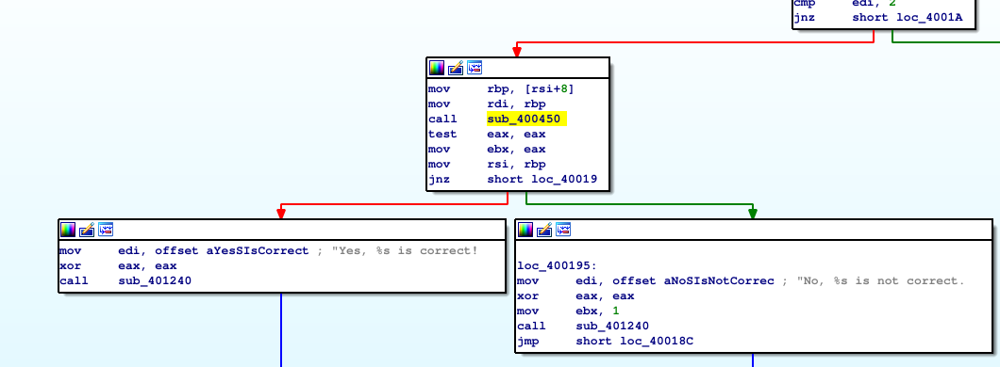
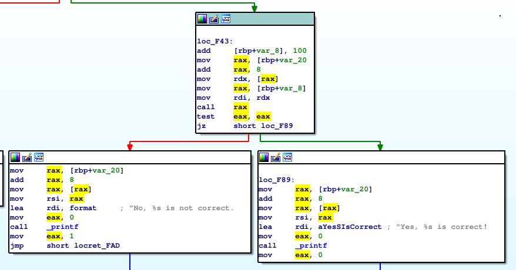

# Obstructing code analysis

## Summary

- [TL;DR](obstructing-code-analysis.md#tl-dr)
- [Target](obstructing-code-analysis.md#target)
- [Prevent strings](obstructing-code-analysis.md#prevent-strings)
- [Pointer function calls](obstructing-code-analysis.md#pointer-function-calls)
- [Early Return](obstructing-code-analysis.md#early-return)
- [Jump over invalid bytes](obstructing-code-analysis.md#jump-over-invalid-bytes)
- [Overlapping instructions](obstructing-code-analysis.md#overlapping-instructions)
- [INT3](obstructing-code-analysis.md#int3)
- [Final code](obstructing-code-analysis.md#final-code)

## TL;DR

- One way to prevent `strings` is to use stacked xor string.
- We can use pointers to call our functions and prevent cross references in IDA for example.
- It's possible to write assembly in our C code and add instructions that will be disassembled and obstruct the code analysis.
- We can mess with the disassembler by forcing it to exit earlier a function, make it disassemble invalid code or even use overlapping code that it won't be able to disassemble.
- You can add `INT3` instruction to stop debuggers whenever you want.

## Target

We'll use the same example we used in the previous articles, you can find the CMake in the first article of this serie (Compiler Options), but here's a reminder.

```c
#include <stdio.h>
#include <string.h>
#include "anti_debug.h"

void __attribute__((constructor)) before_main()
{
  dbg_checker();
}

int check_password(const char* p_password)
{
  char magnupass[9] = "MagnuB33r";
  return memcmp(magnupass, p_password, 9) != 0;
}

int main (int argc, char** argv) {

    if (argc != 2) {
        printf("Need exactly one argument.\n");
        return -1;
    }

    if (check_password(argv[1])) {
        printf("No, %s is not correct.\n", argv[1]);
        return 1;
    } else {
        printf("Yes, %s is correct!\n", argv[1]);
    }
    return 0;
}
```

The header file for anti_debug:

```c
#ifndef _ANTI_DEBUG_H_
#define _ANTI_DEBUG_H_

typedef int bool;
#define true 1
#define false 0

void dbg_checker();
int check_ptrace();
int dbg_file_descriptor();
int dbg_cmdline();
int dbg_getppid_name();
int various_ldpreload();

#endif
```

And the anti_debug.c:

```c
#include <signal.h>
#include <stdio.h>
#include <unistd.h>
#include <stdlib.h>
#include <string.h>
#include <sys/ptrace.h>
#include <sys/prctl.h>

typedef int bool;
#define true 1
#define false 0

#define check_strings(str_buff) (strstr(str_buff, "gdb") || strstr(str_buff, "ltrace") || strstr(str_buff, "strace") || (strstr(str_buff, "radare2")) || (strstr(str_buff, "ida")))

void dbg_checker();
int check_ptrace();
int dbg_file_descriptor();
int dbg_cmdline();
int dbg_getppid_name();
int various_ldpreload();

void dbg_checker()
{
  /* prevent core dump */
  prctl(PR_SET_DUMPABLE, 0);

  if (check_ptrace() == 1)
  {
    exit(0);
  }

  if (dbg_file_descriptor() == 1)
  {
    exit(0);
  }

  if (dbg_cmdline() == 1)
  {
    exit(0);
  }

  if (dbg_getppid_name() == 1)
  {
    exit(0);
  }

  if (various_ldpreload() == 1)
  {
    exit(0);
  }
}

/* Check if ptrace is already attached */
int check_ptrace()
{
  return ptrace(PTRACE_TRACEME, 0, NULL, NULL) != 0;
}

/* 2 file descriptors when programs open with GDB. Both pointing to the program being debugged.*/
int dbg_file_descriptor()
{
    FILE* fd = fopen("/", "r");
    int nb_fd = fileno(fd);
    fclose(fd);

    return (nb_fd > 3);
}

/* Detect GDB by the mean of /proc/$PID/cmdline, which should no be "gdb" */
int dbg_cmdline()
{
    char buff [24], tmp [16];
    FILE* f;

    snprintf(buff, 24, "/proc/%d/cmdline", getppid());
    f = fopen(buff, "r");
    fgets(tmp, 16, f);
    fclose(f);

    return check_strings(tmp);
}

/* Check the parent's name */
int dbg_getppid_name()
{
    char buff1[24], buff2[16];
    FILE* f;

    snprintf(buff1, 24, "/proc/%d/status", getppid());
    f = fopen(buff1, "r");
    fgets(buff2, 16, f);
    fclose(f);

    return check_strings(buff2);
}

/* Try to detect the LD_PRELOAD trick by looking into environnement variables of the program. */
int various_ldpreload()
{
    return (getenv("LD_PRELOAD") != NULL);
}
```

## Prevent strings

With the current program, even if we modify the ELF file, set the good compiler options etc, we're still vulnerable to the best reverse tool for crackmes: `strings`. (The output has been truncated)

```bash
magnussen@funcMyLife:~/embuche/build$ strings ./crackme
MagnuB33r
```

One way to prevent `strings` is to add each byte of our string into the stack one by one.

We'll hide the construction of our string with stacked string. Here's the code:

```c
int check_password(const char* p_password)
{
  char magnupass[10] = {'M', 'a', 'g', 'n', 'u', 'B', '3', '3', 'r', 0};
  return memcmp(magnupass, p_password, 10) != 0;
}
```

If we use `strings`, our password is not visible, but we can still find it easily with radare2 for example.

```
|           0x563fa9d2b955      c645ee4d       mov byte [local_12h], 0x4d ; 'M' ; 77
|           0x563fa9d2b959      c645ef61       mov byte [local_11h], 0x61 ; 'a' ; 97
|           0x563fa9d2b95d      c645f067       mov byte [local_10h], 0x67 ; 'g' ; 103
|           0x563fa9d2b961      c645f16e       mov byte [local_fh], 0x6e ; 'n' ; 110
|           0x563fa9d2b965      c645f275       mov byte [local_eh], 0x75 ; 'u' ; 117
|           0x563fa9d2b969      c645f342       mov byte [local_dh], 0x42 ; 'B' ; 66
|           0x563fa9d2b96d      c645f433       mov byte [local_ch], 0x33 ; '3' ; 51
|           0x563fa9d2b971      c645f533       mov byte [local_bh], 0x33 ; '3' ; 51
|           0x563fa9d2b975      c645f672       mov byte [local_ah], 0x72 ; 'r' ; 114
```

One way to prevent that, is to ciphered our string with a xor, it's simple but an attacker will have to find the key to decrypt our string.

Here's the final `check_password` function and the function to xor our string to retrieve the clear string:

```c
char* undo_xor_string(char* string, int length, char* key, int key_length)
{
    for (int i = 0; i < length; i++)
    {
        string[i] = string[i] ^ key[i % key_length];
    }

    return string;
}

int check_password(const char* p_password)
{
  char magnupass[10] = {0x39, 0xbe, 0xaf, 0xc3, 0x98, 0xd9, 0x27, 0xf0, 0xc4, 0};
  char key_pass[10] = {0x74, 0xdf, 0xc8, 0xad, 0xed, 0x9b, 0x14, 0xc3, 0xb6, 0};

  return memcmp(undo_xor_string(magnupass, 10, key_pass, 10), p_password, 10) != 0;
}
```

Our string is still visible, but with the next parts we'll be able to alter the way a disassembler process our decryption function and make our string more difficult to retrieve.

## Pointer function calls

Disassemblers are oftenly able to show how functions are connected with cross references.

For example, even if we don't have the symbol table, it's still pretty obvious that our crackme depends on this function.



One way to prevent that, is to use indirect references to our `check_password` function.

To do that we can use functions pointers and mess a little with its value to prevent IDA to know where the pointer refers to.

```c
int main (int argc, char** argv) {
    bool (*indirect_call)(const char*) = NULL;

    indirect_call = check_password - 0x100;

    if (argc != 2) {
        printf("Need exactly one argument.\n");
        return -1;
    }
    indirect_call = indirect_call + 0x100;

    if ((*indirect_call)(argv[1])) {
        printf("No, %s is not correct.\n", argv[1]);
        return 1;
    } else {
        printf("Yes, %s is correct!\n", argv[1]);
    }
    return 0;
}
```

We defined a NULL pointer to prevent IDA to determine the location it refers, we store the value of the `check_password` function minus 0x100, like that our pointer will not refer to the proper function but we'll be able use it later by adding 0x100.

When we need to use our function, we simply add 0x100 to our pointer to refer to the `check_password` function and call it like we normally do.



The `check_password` function isn't directly called in our code, so IDA isn't able to create cross references.

## Early Return

First of all, to understand this part we need to understand how a disassembler works.

A disassembler has two options:

- Linear sweep: It reads the first N-bytes until it gets a correct opcode. If the data are bad, it proceeds until it gets the next valid opcode.
- Recursive Traversal: It reads the first N-bytes until it gets a correct opcode. It keeps disassemble until it finds any sort of jump, then it store is the current position, follow the jump and proceed as described. It stops when it gets an invalid opcode and resume at the previously stored position.

What it means, is that disassembler reads N-Bytes and try to find a correct opcode and leave the data if they don't match opcodes.

We can trick the disassembler and prevent it to disassemble a function by forcing it to exit a function earlier.

Let's take the following example:

```asm
extern char* __executable_start;

char* calc_addr(char* p_addr)
{
    return p_addr + (unsigned long)&__executable_start;
}

int __attribute__((optimize("O1"))) main()
{
  char* label_address = 0;

  label_address = calc_addr(((char*)&&return_here) - (unsigned long)&__executable_start);

  asm volatile(
  "push %0\n"
  "ret\n"
  ".string \"\x72\x73\x74\x75\x76\x77\x78\x79\x7a\x7b\x7c\x7d\x7e\x7f\""
  :
  : "g"(label_address));

  return_here:

  return 0;
}
```

Our main function just returns 0, it doesn't do anything else.

What we do is that we add some assembly code to force the disassembler to exit our main earlier with:

```
push %0
ret
```

We also add some garbage to prevent it to disassemble more code with:

```
.string \"\x72\x73\x74\x75\x76\x77\x78\x79\x7a\x7b\x7c\x7d\x7e\x7f\"
```

So basically the disassembler will see that the function is over (push; ret) and confirms it with the garbage we added and that doesn't match any opcode. The disassembler will stop processing our main function and hide the `return 0;`.

In order to prevent the execution of our early return (the main will exit without returning 1), we have to say to the program to pass the assembly and go directly after it.

To do that we can use a label:

```c
label_address = calc_addr(((char*)&&return_here) - (unsigned long)&__executable_start);

return_here:

```

Essentially the first line calculates the offset we are (current address (&&return_here) minus the base address of our program (&__executable_start)) and go to this address (return_here:). This line allows us to pass the assembly code and execute the program normally.

As seen in the previous part, we mess with the label address to prevent cross references.
We use `calc_addr` to retrieve the right address to go to.

The last thing we have to do, is set an attribute (`__attribute__((optimize("O1")))`) to our function to prevent the assembly from being optimized at compilation.

So basically what we do is put some assembly code that will be disassembled, but won't be executed to force the disassembler to quit the function earlier.

## Jump over invalid bytes

Now that we know how to mess with a disassembler, we can use other techniques like setting invalid bytes to be disassembled.

We know that a disassembler takes N-bytes and try to find a valid opcode. As seen previously, it's possible for us to put some assembly that will be interpreted by the dissassembler but won't be executed by our program.

We can use the following code to fool the disassembler:

```
asm volatile(
  "jmp unaligned\n"
  ".short 0xe8\n"
  "unaligned:");
```

We insert an invalid byte that will be processed by the disassembler.

The disassembler will try to find an opcode with this invalid byte and will mess the next assembly it'll produce.

We want this invalid byte to be ignored at runtime, so we simply jump over it with a label.

At runtime, the invalid byte will be ignored, but it will processed by the disassembler and mess with the assembly code it produces.

The problem with this code is that a smart disassembler will be able to pass this invalid byte as it knows that the invalid byte will never be executed.

To prevent that we can use a conditional jump:

```
asm volatile(
  "jz unaligned+1\n"
  "jnz unaligned+1\n"
  "unaligned:\n"
  ".byte 0xe8\n");
```

So we use the same logic as the previous code, we jump over the invalid byte (unaligned+1) if the condition is true or false (so in all cases), but the disassembler will this time disassemble our invalid byte.

The only problem is that the double jump is pretty distinctive.

We can replace this double jump by a conditional jump that will always be true.

```
asm volatile(
  "xor %%rax, %%rax\n"
  "jz always_here + 1\n"
  "always_here:\n"
  ".byte 0xe8\n"
  : :
  : "%rax");
```

If we xor a register with itself, the result will be 0, so it will always take the jump `jz` (jump if zero) and jump over our invalid byte.

With the last code we mess with the disassembler by injecting an invalid byte that will be disassembled, but never executed as the condition is always true (we jump over it).

## Overlapping instructions

The next technique we can use to fool even the smarter disassembler is overlapping instructions.

It's possible to write code that is executed twice but represents two different instructions, this will be a problem for the disassembler.

There's an important concept that we left out until now, a disassembler only disassemble once. It means once an instruction has been disassembled, it won't disassemble it again.

For example, if we call a function multiple times, the dissassembler will process it the first time, but it won't disassembled it again because it knows that the function was already been disassembled.

This will be useful for our next technique. We'll use the following code:

```
asm volatile(
  "mov_ins:\n"
  "mov $2283, %%rax\n"
  "xor %%rax, %%rax\n"
  "jz mov_ins+3\n"
  ".byte 0xe8\n"
  : :
  : "%rax");
```

So we move 0xe8b into rax, we clear rax, and jump to mov_ins label plus three. Nothing too harmful at first.

But the jump to mov_ins plus three is in the middle of the first mov instruction.
The assembly that starts at this position (mov_ins+3) is a jump that skips the remaining code of this block to the next byte of legitimate code.

So basically the disassembler doesn't follow our `jz mov_ins+3` but our code does, and when our code jump to this position it finds a jump that pass all the instructions we added until the next block of valid code.

The disassembler is unable to process the next chunk of code because it hasn't followed the `js mov_ins+3` but our code did.

That one is pretty vicious...

## INT3

If you're used to debuggers, you probably know a very convenient feature: breakpoints.

A breakpoint allows you to stop the execution of a program when it reaches a position to investigate on the code at this position.

It's really convenient when you want to debug a program, but it can be really annoying if you don't set them yourself and the program keeps stopping its execution.

A INT3 instruction is used by debuggers to temporarily replace an instruction in a running program in order to set a code breakpoint. The program will return a signal that will be handled by the debugger when it reach that instruction.

When the program is executed outside a debugger, the signal isn't handle so the program continues its execution, but when it's executed inside a debugger, the signal is handled by the debugger and the program wait for the "continue" signal to pursue its execution.

We can set INT3 instruction in our program to force a debugger to stop when an attacker tries to debug our code. The main purpose of this technique is just to annoy the attacker when it debugs our program by stopping its debugger regularly.

```c
void int3_shield(int signo);

int main(int argc, char **argv){

    signal(SIGTRAP, int3_shield); // place this line at the beginning of your main() function
    __asm__("int3"); // Place this line wherever you want in your program, it will stop the debugger in its tracks.
    // you can put it multiple times if you want, try not to place it in "sensitive areas" where the code is important

    return 0;
}

// put this in your .h or in your code
void int3_shield(int signo){
}
```

This technique is pretty simple to implement, we just place the `int3` instruction in our code multiple time to force the debugger to stop when it reads this instruction.

## Final code

So here's the final code to mess with disassembler:

```c
#include <stdio.h>
#include <string.h>
#include "anti_debug.h"

extern char* __executable_start;

void __attribute__((constructor)) before_main()
{
  dbg_checker();
}

char* calc_addr(char* p_addr)
{
    return p_addr + (unsigned long)&__executable_start;
}

char* undo_xor_string(char* string, int length, char* key, int key_length)
{
    for (int i = 0; i < length; i++)
    {
        string[i] = string[i] ^ key[i % key_length];
    }

    return string;
}

int check_password(const char* p_password)
{
  char magnupass[10] = {0x39, 0xbe, 0xaf, 0xc3, 0x98, 0xd9, 0x27, 0xf0, 0xc4, 0};
  char key_pass[10] = {0x74, 0xdf, 0xc8, 0xad, 0xed, 0x9b, 0x14, 0xc3, 0xb6, 0};

  return memcmp(undo_xor_string(magnupass, 10, key_pass, 10), p_password, 10) != 0;
}

int __attribute__((optimize("O1"))) main (int argc, char** argv) {
    bool (*indirect_call)(const char*) = NULL;
    char* label_address = 0;

    asm volatile(
    "mov_ins:\n"
    "mov $2283, %%rax\n"
    "xor %%rax, %%rax\n"
    "jz mov_ins+3\n"
    ".byte 0xe8\n"
    : :
    : "%rax");

    asm volatile(
      "xor %%rax, %%rax\n"
      "jz always_here + 1\n"
      "always_here:\n"
      ".byte 0xe8\n"
      : :
      : "%rax");

    indirect_call = check_password - 0x100;

    if (argc != 2) {
        printf("Need exactly one argument.\n");
        return -1;
    }

    label_address = calc_addr(((char*)&&return_here) - (unsigned long)&__executable_start);

    asm volatile(
    "push %0\n"
    "ret\n"
    ".string \"\x72\x73\x74\x75\x76\x77\x78\x79\x7a\x7b\x7c\x7d\x7e\x7f\""
    :
    : "g"(label_address));

    indirect_call = indirect_call + 0x100;

    if ((*indirect_call)(argv[1])) {
        printf("No, %s is not correct.\n", argv[1]);
        return 1;
    } else {
        printf("Yes, %s is correct!\n", argv[1]);
    }
    return 0;
}
```
