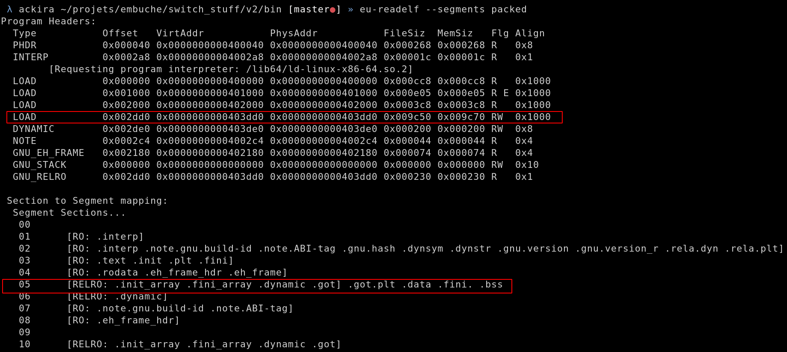
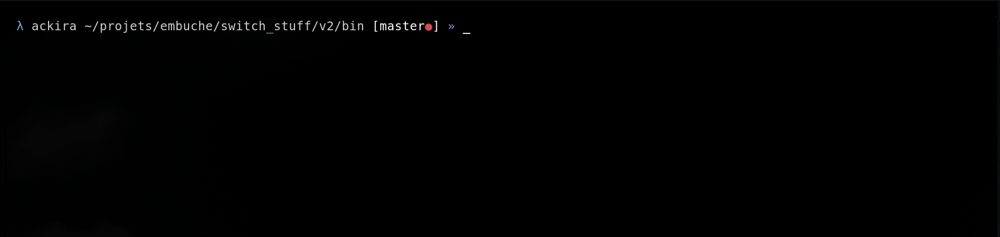

# Embuche packer

## Summary

- [TL;DR](packer.md#tl-dr)
- [Before compilation](packer.md#before-compilation)
  - [Adding a section](packer.md#adding-a-section)
  - [Linker scripts](packer.md#linker-scripts)
- [Post compilation](packer.md#post-compilation)
- [Runtime](packer.md#runtime)

A metamorphic packer is available with Embuche. This packer loads a binary and cipher it (AES 256 bits CBC).

The program is ciphered and stored in a section of the packer. When the program is executed, the packer will copy itself in memory, unciphered the program and write it on the disk for execution.

## TL;DR

- Embuche's packer cipher the program and store it in the `.fini.` section
- The `.fini.` section is loaded in memory at runtime.
- The `.text` section (code of the program) is encrypted in AES 256 bits CBC.
- The key and ciphered program changes at each execution as it's the result of sha256sum(`.text`) xor'ed with the timestamp at runtime.

## Before compilation

The packer needs to host the legitimate program in order to load it at runtime. In order to do that we have to prepare the packer to receive the program by adding a section of the size of the program in the packer.

The packer will cipher our program (AES 256 bits CBC) before adding it to a section.

### Adding a section

The program will be stored in a section of the packer. We need to prepare the packer to host the legitimate program.

The ELF of the program will be stored in a section called `.fini.` in order to look like a legitimate section.

We have to know the size of the program if we want to create this new section. As the program will be ciphered with AES in this section we have to know the size of the program once padded (*PKCS#5*).

The packer script ([packer.py](../class_embuche/cmake_bakery/packer/scripts/packer.py)) will return the size of a program once padded.

```bash
magnussen@funcMyLife:~/embuche$ python3.8 class_embuche/cmake_bakery/packer/scripts/packer.py crackme
13648
```

Now that we know that the size of our binary once ciphered is 13648 bytes we can create a new section of this size.

We can create a new section in C as such:

```C
extern char stack[REAL_SIZE] __attribute__ ((section (".fini.")));
```

The **make** file will pass the value of *REAL_SIZE* to GCC at compilation (through a *#define* directive) and GCC will add a section called *.fini.* of the size of our padded program in our packer.

In order to launch the program, we have to map this new section in memory. In order to make this section executable we have to describe it in a segment.

We use `memfd_create` in order to create this segment and load our section in memory.

We can see this new section and segment with `eu-readelf`.



### Linker scripts

The packer needs to know the size and address of the `.text` section in order to create the keys used to ciphered and deciphered the program that it stored.

Unfortunately, this information is only available after completion.

We can use *linker scripts* to retrieve these informations. The linker is in charge of adding sections, edit links etc during the compilation.

We use a linker script ([layout.lds](../class_embuche/cmake_bakery/packer/src/layout.lds)) to define two variables that will store the address and size of the `.text` section:

```
SECTIONS
{
    text_addr = ADDR(.text);
    text_size = SIZEOF(.text);
}
```

We define these two variables in our [packer](../class_embuche/cmake_bakery/packer/includes/consts.h) as such:

```C
#ifndef CONSTS_H
#define CONSTS_H

[...]

extern void *text_size;
extern void* text_addr;

#endif /* CONSTS_H */
```

We can check the presence of these two variables with `nm`:

```
 λ ackira ~/projets/embuche/switch_stuff/v2/build [master●] » nm ../bin/packed | grep text
[...]
0000000000401220 T text_addr
0000000000000bd5 A text_size
```

## Post compilation

Once we compile our packer we have the `.fini.` section initialized and the keys to cipher our program.

We cipher our program with the sha256sum of the `.text` section and insert the ciphered program in the `.fini.` section with **HELLF**.

```python
    surprise = unloaded.get_section_by_name(".fini.")
    text = unloaded.get_section_by_name(".text")

    # computing .text section sha256
    text_sum = sha256(text.data).hexdigest()
    print(good(".text sha256 sum : ") + text_sum)

    key = bytearray.fromhex(text_sum)

    binary_to_be_packed = pad(open(argv[2], "rb").read(), 16)

    encryptor = AES.new(key, AES.MODE_CBC, iv)

    # we are adding 16 bytes of metadata, which are the place holder for the timestamp of the last run and the address of the .fini. section on disk.
    encrypted = (
        pack("<Q", 0)
        + pack("<Q", surprise.sh_offset)
        + encryptor.encrypt(binary_to_be_packed)
    )

    surprise.data = encrypted
    print(good("encrypted binary size : {}".format(len(encrypted))))

    unloaded.save(argv[3])
```

## Runtime

At the first execution the key used for decryption is just the sha256sum of the `.text` section. But once the program has been run once, the key used for decryption is the sha256sum of the `.text` section xor'ed with the timestamp of the last execution (sha256(.text) ^ timestamp).

In order to use the timestamp of the last execution and load the program we store 16 bytes at the start of the ciphered program in the `.fini.` section:

- First 8 bytes: Timestamp of the last execution.
- Last 8 bytes: Address of the `.fini.` section. The section address is different of the mapped address of the section (*stack*). This variable is used to write the `.fini` section on disk at runtime.

By using the sha256sum we ensure the integrity of the program. If an attacker place a breakpoint at runtime, the `.text` section will be modified (the debugger insert `int3` or `Oxcc` instruction) and the packer won't be able to decipher the legitimate program.

To ensure this integrity at each run, the packer recipher the program at each execution with the timestamp of execution. So at the next run, the new timestamp will be used to decipher the program.

So when the packer is run:

- It recreates the key to decipher the program by xor'ing the last timestamp with the sha256sum of `.text` section (or just uses the sha256sum if it's the first execution).
- Loads the `.text` in memory to run it.
- Ciphers the `.text` section with the timestamp.
- Writes the new ciphered `.text` section and timestamp for the next run.


